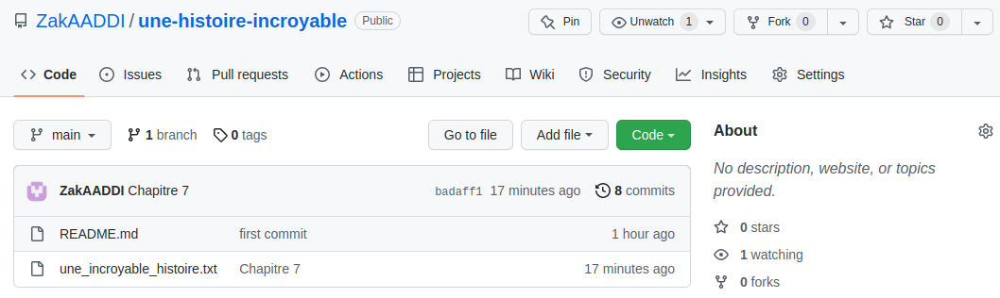
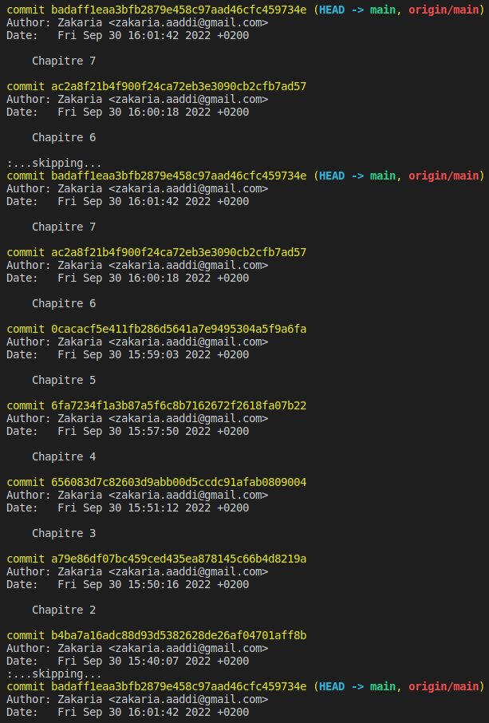

# Preuve de travail avec Git.

### Travail réaliser à travers les imprimes écran suivant :

## Dépôt sur GitHub :

## Travail réalisé : 

## Revert - Commit antérieur :

## Création du Tag sur GitHub :

